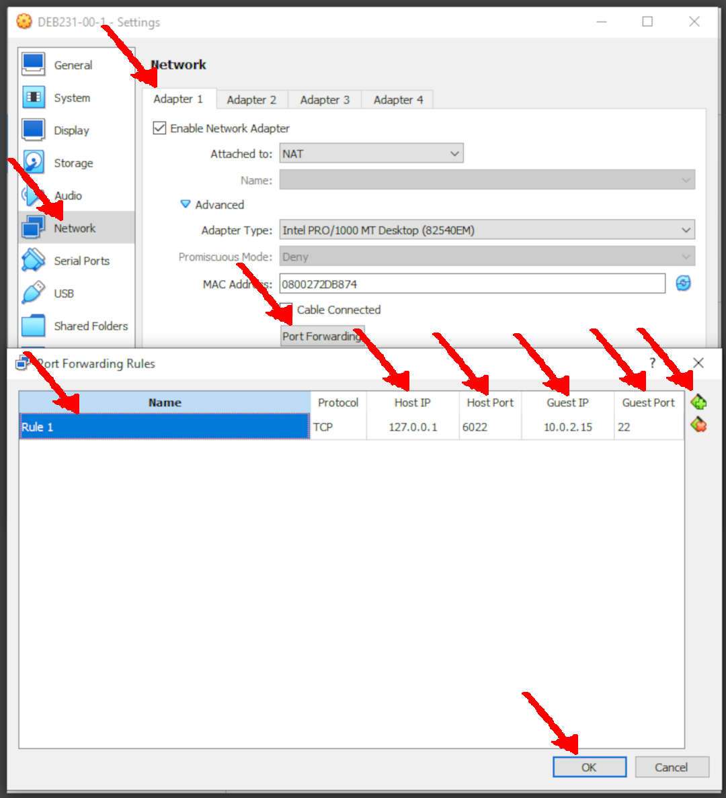

# DocuDemo
* [VirtualBox OVA](#idx01)
* [NAT Port Forwarding (port 3000 to 5001)](#idx02)
* [GitHub](#idx03)
* [Debian 11 sources.list (root)](#idx04)
* [Debian Package (root)](#idx05)
* [Default Shell: BASH](#idx06)
* [Setting Debian](#idx07)


[&#x213C;](#)<br id="idx01">
## VirtualBox OVA 
* Source: DOCU-2304-02.ova (Debian 11.7)
* Ref:
  * Debian ISO <https://doit.vlsm.org/012.html>
  * Preparation <https://doit.vlsm.org/013.html>
  * Instalation <https://doit.vlsm.org/014.html>

[&#x213C;](#)<br id="idx02">
## NAT Port Forwarding (port 3000 to 5001)

```
| ------ | -------- | --------- | --------- | --------- | ---------- |
| Name   | Protocol | Host IP   | Host Port | Guest IP  | Guest Port |
| ------ | -------- | --------- | --------- | --------- | ---------- |
| Rule 2 | TCP      | 127.0.0.1 | 5001      | 10.0.2.15 | 3000       |
| ------ | -------- | --------- | --------- | --------- | ---------- |
```



[&#x213C;](#)<br id="idx03">
## Github
* URL: <https://github.com/yforku/>
* New Repo: [DocuDemo](https://github.com/yforku/DocuDemo/), Public, README, .gitignore:Node, MIT License, master branch

[&#x213C;](#)<br id="idx04">
## Debian 11 sources.list (root)
* Ref:
  * sources.list <https://osp4diss.vlsm.org/osp-102.html>

```
[ -f /etc/apt/sources.list ] && mv /etc/apt/sources.list /etc/apt/sources.list.zold
cat > /etc/apt/sources.list << EOF
deb https://deb.debian.org/debian/  bullseye           main contrib non-free
deb https://security.debian.org/    bullseye-security  main contrib non-free
deb https://deb.debian.org/debian/  bullseye-updates   main contrib non-free
deb https://deb.debian.org/debian/  bullseye-backports main contrib non-free
EOF
apt-get update && apt-get upgrade -y

```

[&#x213C;](#)<br id="idx05">
## Debian Package (root)

```
MYUSER="cbkadal"
export DEBS="
aptitude
git
sudo
vim
"
date;
time apt-get install $DEBS -y
[ -d /etc/sudoers.d/ ] && echo "$MYUSER    ALL=(ALL:ALL) ALL" > /etc/sudoers.d/$MYUSER
time (aptitude update&&echo " =1= "&&aptitude safe-upgrade -y&&echo " =2= "&&aptitude autoclean -y;)

```

[&#x213C;](#)<br id="idx06">
## Default Shell: BASH (root)
* say “NO” for DASH

```
dpkg-reconfigure dash

```

[&#x213C;](#)<br id="idx07">
## Setting Debian
* Ref:
  * <https://osp4diss.vlsm.org/osp-106.html>
  * <https://osp4diss.vlsm.org/osp-107.html>
  * <https://osp4diss.vlsm.org/osp-108.html>
* Add User --- <https://osp4diss.vlsm.org/osp-104.html> --- because you are NOT CBKADAL!
* You might want to rename your hostname --- <https://osp4diss.vlsm.org/osp-105.html>
* Set $HOME/.bash_profile

```
touch  $HOME/.bash_profile
ls -al $HOME/.bash_profile
sleep 2
cat > $HOME/.bash_profile << EOF
# Thu 15 Jul 2021 15:16:28 WIB
umask 022

# If running bash
[ -n "\$BASH_VERSION" ] && {
    # include .bashrc if it exists
    [ -f \$HOME/.bashrc ] && . \$HOME/.bashrc
}

# Local PATH
[ -d "\$HOME/bin" ]        && PATH="\$HOME/bin:\$PATH"
[ -d "\$HOME/.local/bin" ] && PATH="\$HOME/.local/bin:\$PATH"

EOF

ls -al $HOME/.bash_profile
sleep 2
source $HOME/.bash_profile

```


* Set .bash_aliases (too keep the original .bashrc) and .vimrc

```
cat > $HOME/.vimrc << EOF
syntax off
EOF

cat > $HOME/.bash_aliases << EOF
# REV02: Fri 05 May 2023 09:00
# REV01: Wed 08 Feb 2023 17:00
# START: Sun 09 Jan 2022 15:00

alias cl='clear;echo ""'
alias h='history'
alias gac='git add -A && git commit'
alias ggg='git pull; git add -A; git commit -m "OS231 cbkadal"; git push;'
alias glog='git log --all --decorate --oneline --graph'
alias mv='mv -i'
alias rm='rm -i'
alias sss='. ~/.bash_profile'
export EDITOR=/usr/bin/vi
export HISTSIZE=2000
export HISTFILESIZE=2000
EOF

source $HOME/.bash_profile

```


## This is the Way!

```
REV03: Fri 05 May 2023 09:00
REV02: Thu 04 May 2023 16:00
REV01: Wed 03 May 2023 20:00
START: Sat 29 Apr 2023 13:00
```
